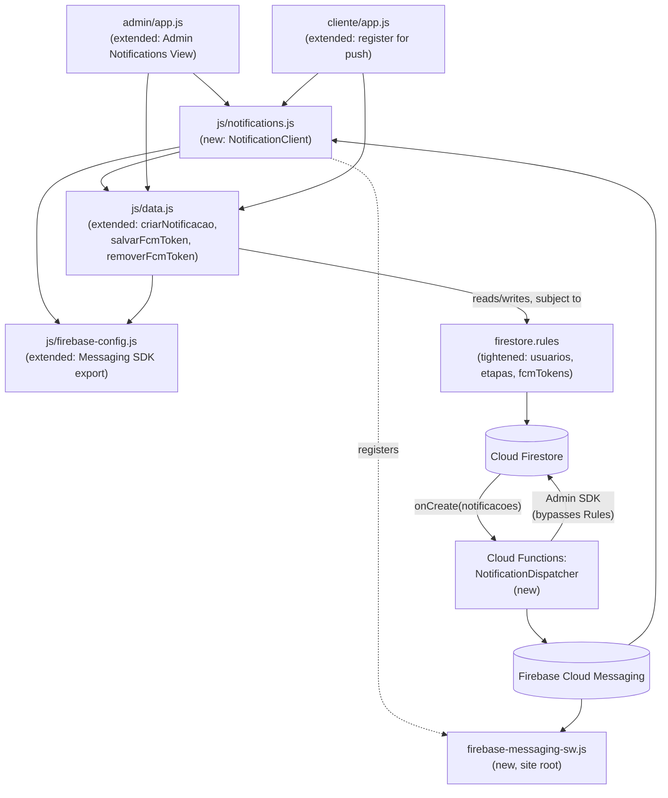

# Component Dependencies (Unit 2)

## Dependency Diagram

## Dependency Details

### `admin/app.js` → `js/notifications.js` (new)
- **Type**: Runtime (ES module import)
- **Reason**: Calls `initNotifications(uid, 'admin')` after login; registers `onForegroundMessage` to refresh the new Admin Notifications View.

### `cliente/app.js` → `js/notifications.js` (new)
- **Type**: Runtime (ES module import)
- **Reason**: Same pattern as admin, `tipo:'cliente'` — replaces the current in-app-only notification experience with push-backed delivery per FR-3.1.

### `js/notifications.js` → `js/data.js`
- **Type**: Runtime (ES module import)
- **Reason**: Persists/removes FCM tokens via `salvarFcmToken`/`removerFcmToken`.

### `js/notifications.js` → `js/firebase-config.js`
- **Type**: Runtime (ES module import)
- **Reason**: Needs the initialized Messaging SDK instance, following the existing single-chokepoint pattern already used for Auth/Firestore/Storage.

### `js/notifications.js` → `firebase-messaging-sw.js` (registration only, not an import)
- **Type**: Runtime (`navigator.serviceWorker.register(...)`)
- **Reason**: The service worker file must be registered before `getToken()` can succeed for background push.

### `js/data.js` (all reads/writes) → `firestore.rules`
- **Type**: Enforced at the Firestore server, not a code-level import
- **Reason**: Every client write this app makes — old or new — is now subject to the tightened `usuarios`/`etapas`/`fcmTokens` rules; this is the dependency that actually closes findings #1/#2.

### `Cloud Firestore` → `Cloud Functions: NotificationDispatcher` (new)
- **Type**: Firestore trigger (`onCreate`)
- **Reason**: The only mechanism by which a client-side write becomes a server-side action in this architecture.

### `Cloud Functions: NotificationDispatcher` → `Cloud Firestore`
- **Type**: Runtime (Admin SDK, bypasses `firestore.rules` by design — Admin SDK calls are always trusted)
- **Reason**: Reads `usuarios/{uid}.fcmTokens` for recipient resolution, and calls `removerFcmToken` (or the equivalent Admin SDK write) on invalid-token cleanup.

### `Cloud Functions: NotificationDispatcher` → `Firebase Cloud Messaging`
- **Type**: Runtime (FCM Admin SDK)
- **Reason**: The actual push-send call — no other component in this app can perform this (a device cannot push to another device without a trusted server intermediary).

### `Firebase Cloud Messaging` → `firebase-messaging-sw.js` / `js/notifications.js`
- **Type**: Push delivery (browser-mediated, not a direct code dependency)
- **Reason**: FCM delivers to whichever context is active on the recipient's device — the service worker if backgrounded, the page's `onMessage` listener if foregrounded.

## New vs. Existing Components Summary
- **New**: `js/notifications.js`, `firebase-messaging-sw.js`, Cloud Functions `NotificationDispatcher`, the Admin Notifications View (inside `admin/app.js`/`admin/index.html`).
- **Extended**: `js/data.js` (`criarNotificacao`, `escutarNotificacoes`, `salvarFcmToken`, `removerFcmToken`), `js/firebase-config.js` (Messaging SDK export), `firestore.rules` (tightened `usuarios`/`etapas`, new `fcmTokens` field rule, updated `notificacoes` rule for `destinatarioTipo`), `admin/app.js` + `admin/index.html` (new notifications tab/view), `cliente/app.js` (call `initNotifications` instead of/alongside its current in-app-only listener), `manifest.json` (finally linked from all HTML entry points, per Component: Service Worker's note in components.md).
- **Untouched by Unit 2**: `admin/app.js`'s obras/etapas/parceiros/preços logic, `cliente/app.js`'s solicitação/orçamento/pagamento logic, `css/style.css`, `storage.rules` (no FR-3 requirement touches Storage).
