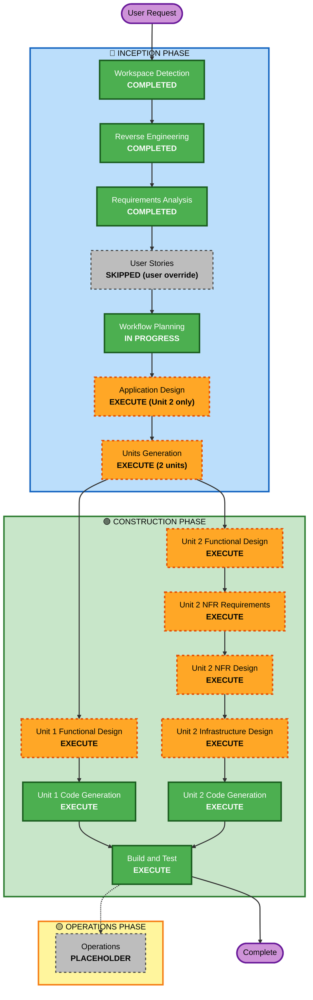

```mermaid
flowchart TD
    Start(["New Request: Avaliação por Parceiro"])

    subgraph INCEPTION["🔵 INCEPTION PHASE"]
        RA3["Requirements Analysis<br/><b>COMPLETED</b>"]
        US3["User Stories<br/><b>SKIPPED (user override)</b>"]
        WP3["Workflow Planning<br/><b>IN PROGRESS</b>"]
        AD3["Application Design<br/><b>SKIP</b>"]
        UG3["Units Generation<br/><b>SKIP</b>"]
    end

    subgraph CONSTRUCTION["🟢 CONSTRUCTION PHASE"]
        FD3["Functional Design<br/><b>EXECUTE</b>"]
        NFRA3["NFR Requirements<br/><b>EXECUTE</b>"]
        NFRD3["NFR Design<br/><b>EXECUTE</b>"]
        ID3["Infrastructure Design<br/><b>SKIP</b>"]
        CG3["Code Generation<br/><b>EXECUTE</b>"]
        BT3["Build and Test<br/><b>EXECUTE</b>"]
    end

    Start --> RA3 --> US3 --> WP3 --> AD3 --> UG3
    UG3 --> FD3 --> NFRA3 --> NFRD3 --> ID3 --> CG3 --> BT3
    BT3 --> End(["Complete"])

    style RA3 fill:#4CAF50,stroke:#1B5E20,stroke-width:3px,color:#fff
    style US3 fill:#BDBDBD,stroke:#424242,stroke-width:2px,stroke-dasharray: 5 5,color:#000
    style WP3 fill:#4CAF50,stroke:#1B5E20,stroke-width:3px,color:#fff
    style AD3 fill:#BDBDBD,stroke:#424242,stroke-width:2px,stroke-dasharray: 5 5,color:#000
    style UG3 fill:#BDBDBD,stroke:#424242,stroke-width:2px,stroke-dasharray: 5 5,color:#000
    style FD3 fill:#FFA726,stroke:#E65100,stroke-width:3px,stroke-dasharray: 5 5,color:#000
    style NFRA3 fill:#FFA726,stroke:#E65100,stroke-width:3px,stroke-dasharray: 5 5,color:#000
    style NFRD3 fill:#FFA726,stroke:#E65100,stroke-width:3px,stroke-dasharray: 5 5,color:#000
    style ID3 fill:#BDBDBD,stroke:#424242,stroke-width:2px,stroke-dasharray: 5 5,color:#000
    style CG3 fill:#4CAF50,stroke:#1B5E20,stroke-width:3px,color:#fff
    style BT3 fill:#4CAF50,stroke:#1B5E20,stroke-width:3px,color:#fff
    style Start fill:#CE93D8,stroke:#6A1B9A,stroke-width:3px,color:#000
    style End fill:#CE93D8,stroke:#6A1B9A,stroke-width:3px,color:#000
    style INCEPTION fill:#BBDEFB,stroke:#1565C0,stroke-width:3px,color:#000
    style CONSTRUCTION fill:#C8E6C9,stroke:#2E7D32,stroke-width:3px,color:#000

    linkStyle default stroke:#333,stroke-width:2px
```

# Execution Plan

## Detailed Analysis Summary

### Transformation Scope (Brownfield)
- **Transformation Type**: Mixed — Unit 1 is a single-component change (admin panel only); Unit 2 is a genuine architectural transformation (adds the project's first-ever server-side component, Firebase Cloud Functions, plus a service worker for push receipt).
- **Primary Changes**:
  - Unit 1: New client-filter + financial aggregation view and color-coded financial display, entirely within the existing admin panel.
  - Unit 2: Bidirectional push notification system (new Cloud Functions + FCM token model + service worker) bundled with fixing 2 Critical Firestore-rules security findings from the reverse-engineering pass (self-promotion to admin; cross-tenant `etapas` read leak).
- **Related Components**: `admin/app.js`, `admin/index.html`, `cliente/app.js`, `cliente/index.html`, `js/data.js`, `js/auth.js`, `js/firebase-config.js`, `css/style.css`, `firestore.rules`, `storage.rules`, `manifest.json`, plus a new `functions/` Cloud Functions package (does not exist today) and a new service worker file.

### Change Impact Assessment
- **User-facing changes**: Yes — both units change what the admin (and, for Unit 2, the cliente) sees and can do.
- **Structural changes**: No for Unit 1 (stays within the existing client-only architecture). Yes for Unit 2 — first server-side component the project has ever had.
- **Data model changes**: Minor for Unit 1 (read/aggregate existing fields only, no schema change). Yes for Unit 2 — new FCM device-token storage, and `firestore.rules` gets materially rewritten for `usuarios` and `etapas`.
- **API changes**: None for Unit 1. Yes for Unit 2 — new Cloud Functions (callable and/or Firestore-triggered) are net-new "API" surface for this app.
- **NFR impact**: Minor for Unit 1 (must not worsen the listener-churn pattern already flagged in reverse-engineering; see requirements.md Performance section). Significant for Unit 2 — this is where the Security Baseline and Property-Based Testing extensions (both enabled) become concretely actionable for the first time.

### Component Relationships
- **Primary Components**: `admin/app.js` (Unit 1 and part of Unit 2), new `functions/` package (Unit 2 only), `cliente/app.js` (Unit 2 only)
- **Infrastructure Components**: None today; Unit 2 introduces Firebase Cloud Functions as the first one, configured manually via the Firebase console/CLI (consistent with how Firestore/Storage rules are already deployed per `LEIA-ME.md` — no CDK/Terraform is being introduced)
- **Shared Components**: `js/data.js`, `js/auth.js`, `js/firebase-config.js`, `css/style.css` — all touched by one or both units
- **Dependent Components**: `firestore.rules`, `storage.rules` — both units read/write Firestore under rules that Unit 2 is rewriting; sequencing matters (see Package Change Sequence below)
- **Supporting Components**: None (no monitoring/logging/CI exists in this project today; not introduced by this plan — flagged as a Security Baseline gap but out of scope unless a future request expands it)

### Risk Assessment
- **Unit 1 (Fechamento de Caixa e Cores)**: **Low** risk — isolated to the admin panel's existing rendering/aggregation logic, easy to roll back (revert the file), well-understood (same patterns already used throughout `admin/app.js`).
- **Unit 2 (Notificações Push + Correções Críticas de Segurança)**: **High** risk — first-ever Cloud Functions deployment for this project, first-ever Firestore rules rewrite touching the admin-promotion and cross-tenant-read paths (a mistake here could lock out legitimate users or, worse, fail to close the leak), and first-ever push/service-worker integration (browser permission flows, caching pitfalls). Rollback is moderate (Cloud Functions and rules can be redeployed to prior versions, but a bad rules deploy has a live-user blast radius).
- **Overall Project Risk**: Medium-High, driven entirely by Unit 2.

## Workflow Visualization

## Phases to Execute

### 🔵 INCEPTION PHASE
- [x] Workspace Detection (COMPLETED)
- [x] Reverse Engineering (COMPLETED — rerun on 2026-07-06 for current `dev` branch code)
- [x] Requirements Analysis (COMPLETED)
- [x] User Stories (SKIPPED — user override; 3 substantive edge-case questions deferred to per-unit Functional Design)
- [x] Workflow Planning (IN PROGRESS — this document)
- [ ] Application Design — **EXECUTE, scoped to Unit 2 only**
  - **Rationale**: Unit 2 introduces a genuinely new service (Cloud Functions) whose components/methods/triggers need definition before per-unit design. Unit 1 makes no new components — skipped for Unit 1.
- [ ] Units Generation — **EXECUTE**
  - **Rationale**: The work decomposes into 2 units with different risk profiles, different construction-stage needs, and a defined dependency (see Package Change Sequence) — formal unit definition avoids conflating a Low-risk client-only change with a High-risk backend/security change.

### 🟢 CONSTRUCTION PHASE

**Unit 1 — Fechamento de Caixa e Cores (FR-1 + FR-2)**
- [ ] Functional Design — **EXECUTE** — *Rationale*: business logic needs precise definition (sobra calculation, client/obra aggregation, and the 2 edge cases deferred from User Stories: negative-sobra styling, "Sem cliente/Outros" bucket membership for rejected clients). Also where PBT-01 testable-property identification happens for the sobra/aggregation calculations (PBT extension enabled).
- [ ] NFR Requirements — **SKIP** — *Rationale*: no new tech stack, no new NFR beyond the existing performance note already captured in requirements.md (reuse in-memory data, don't add new listeners).
- [ ] NFR Design — **SKIP** — *Rationale*: depends on NFR Requirements, which is skipped.
- [ ] Infrastructure Design — **SKIP** — *Rationale*: pure static client code, no infrastructure change.
- [ ] Code Generation — **EXECUTE (ALWAYS)**

**Unit 2 — Notificações Push e Correções Críticas de Segurança (FR-3 + RE findings #1/#2)**
- [ ] Functional Design — **EXECUTE** — *Rationale*: event→recipient mapping (who gets notified for each of the events in FR-3.3), the deferred deep-linking edge case (A6), and the precise authorization logic for the 2 security fixes need explicit design before code generation, given the security-critical nature of this unit.
- [ ] NFR Requirements — **EXECUTE** — *Rationale*: this is the unit's first opportunity to make concrete tech-stack decisions (Cloud Functions runtime/language, FCM Web SDK setup, PBT framework selection per PBT-09) and the first point where Security Baseline rules (enabled) become evaluable against real infrastructure choices.
- [ ] NFR Design — **EXECUTE** — *Rationale*: incorporate the chosen security patterns (least-privilege Cloud Functions, server-side authorization checks per SECURITY-08) and PBT test-design patterns (stateful testing for notification read/unread state per PBT-06) into the logical design.
- [ ] Infrastructure Design — **EXECUTE** — *Rationale*: must map to actual Firebase infrastructure — which Cloud Functions triggers (Firestore `onCreate`/`onUpdate` vs. callable), service worker registration/hosting, updated `firestore.rules`/`storage.rules` deployment, FCM project configuration.
- [ ] Code Generation — **EXECUTE (ALWAYS)**

- [ ] Build and Test — **EXECUTE (ALWAYS)**, after both units complete
  - **Rationale**: No test framework exists today; this is also where the PBT framework selected in Unit 2's NFR Requirements gets wired into an actual test-execution flow, and where the 2 security fixes need explicit verification (attempt self-promotion, attempt cross-tenant read — confirm both are now denied).

### 🟡 OPERATIONS PHASE
- [ ] Operations — PLACEHOLDER (not in scope for this request)

## Package Change Sequence

1. **Unit 2's `firestore.rules`/`storage.rules` changes first, in isolation** — the security-rule fixes for findings #1/#2 (and the new FCM-token rules) should be deployed and verified before the rest of Unit 2's Cloud Functions/UI code lands, since they are the highest-risk, highest-value part of this whole plan and are logically independent of the push-delivery mechanics.
2. **Unit 2's Cloud Functions + service worker + FCM client integration**, once the rules foundation is confirmed correct.
3. **Unit 1 (Fechamento de Caixa e Cores)** has no dependency on Unit 2 and can be built in parallel with either step above — it only touches `admin/app.js`/`admin/index.html`/`css/style.css` and reads data already covered by existing (unmodified-by-this-plan) rules.

## Estimated Timeline
- **Total Construction Stages**: 2 units × (up to 4 per-unit design stages + Code Generation) + 1 shared Build and Test
- **Estimated Duration**: Not estimated in calendar time per AI-DLC convention (this process tracks stage completion, not hours/days)

## Success Criteria
- **Primary Goal**: Ship FR-1/FR-2/FR-3 without regressing existing functionality, while closing the 2 Critical security findings as part of the same effort.
- **Key Deliverables**: Fechamento de Caixa view with color-coded financials (Unit 1); working push notifications in both directions with an expanded event set, backed by a new Cloud Functions service (Unit 2); rewritten `firestore.rules` that block self-promotion and cross-tenant `etapas` reads.
- **Quality Gates**: Manual verification that a non-admin account cannot write `tipo:'admin'` to its own `usuarios` doc; manual verification that a client account cannot read another client's `etapas`; push notification received end-to-end on at least one real device/browser for both an admin-facing and a cliente-facing event.
- **Integration Testing**: Confirm Unit 1's Fechamento de Caixa numbers reconcile with the existing obra-detail financial figures; confirm Unit 2's new rules don't break any existing, legitimate read/write path used by either panel.

---

# Unit 3 — Avaliação por Critérios vinculada ao Parceiro (FR-4)

**Added**: 2026-07-08, as a new request on top of the (still Build-and-Test-pending-approval) Units 1 & 2. Independent of both — no shared code paths beyond `firestore.rules` and the general obra/parceiro domain.

## Detailed Analysis Summary

### Transformation Scope (Brownfield)
- **Transformation Type**: Single component change — extends the existing obra/parceiro domain inside the current admin and cliente panels; no new service, no new infrastructure.
- **Primary Changes**: Replace the obra's single 1-5 star rating with a 3-criteria rating (Tempo de execução, Acabamento, Organização e limpeza) plus an auto-computed overall average; attribute that rating to every distinct parceiro linked via the obra's completed etapas; display each parceiro's accumulated (running-average) rating on their admin detail screen; expose the parceiro's name to the client at rating time.
- **Related Components**: `cliente/app.js` (`abrirAvaliacao`/`renderEstrelasAvaliacao`/`selecionarEstrela`/`enviarAvaliacaoObra`), `js/data.js` (`enviarAvaliacao`), `firestore.rules` (`match /obras/{obraId}` update rule), `admin/app.js` (`renderParceiroDetalhe`).

### Change Impact Assessment
- **User-facing changes**: Yes — client's rating form changes shape (3 star rows instead of 1, parceiro name now shown); admin's parceiro detail screen gains a new accumulated-rating section.
- **Structural changes**: No — no new component/service boundary, stays within the existing client-only architecture.
- **Data model changes**: Yes — obra's rating fields change shape (3 criteria replacing the single `avaliacaoNota`); **open question for Functional Design**: what happens to obras that already have a legacy `avaliacaoNota` value from before this change ships (migrate, ignore, or backfill as "Geral" with no per-criteria breakdown)?
- **API changes**: None — no new Cloud Functions.
- **NFR impact**: Yes — Security Baseline is concretely applicable: `firestore.rules` gets rewritten again (third rewrite this project, after Unit 2's two), and the client's read scope over parceiro data changes (name-only exposure needs a deliberate, narrow rule — not a blanket `parceiros` read grant to `souClienteAprovado()`).

### Component Relationships
- **Primary Components**: `cliente/app.js`, `js/data.js`, `admin/app.js` (parceiro detail rendering only — not the broader financial/etapa logic)
- **Dependent Components**: `firestore.rules` — same file Unit 2 already touches; if Unit 2 hasn't shipped yet, sequencing/merge conflicts between the two rules changes must be handled (see Package Change Sequence)
- **Supporting Components**: None new

### Risk Assessment
- **Risk Level**: **Low-Medium** — no new infrastructure or backend component (unlike Unit 2), but it does touch live security rules and a user-facing flow with existing production data (obras that already carry a legacy `avaliacaoNota`), and introduces a new, narrower data-exposure path to the client (parceiro name) that must be verified not to leak more than intended.
- **Rollback Complexity**: Easy — client code and rules can be reverted independently of Units 1/2.

## Workflow Visualization

## Phases to Execute

### 🔵 INCEPTION PHASE
- [x] Requirements Analysis (COMPLETED — FR-4 in requirements.md)
- [x] User Stories (SKIPPED — user override, same as Units 1/2)
- [x] Workflow Planning (IN PROGRESS — this document)
- [ ] Application Design — **SKIP**
  - **Rationale**: No new component or service; extends the existing obra/parceiro domain already fully defined. Same rationale as Unit 1.
- [ ] Units Generation — **SKIP**
  - **Rationale**: The request is already a single, atomic unit of work (Unit 3) — no decomposition needed.

### 🟢 CONSTRUCTION PHASE

**Unit 3 — Avaliação por Critérios vinculada ao Parceiro (FR-4)**
- [ ] Functional Design — **EXECUTE** — *Rationale*: needs precise business-rule definition for the accumulation/averaging logic, multi-parceiro attribution (FR-4.6's "concluído" filter assumption to confirm), and the legacy-`avaliacaoNota` migration question flagged above. Also where PBT-01 testable-property identification happens for the new averaging logic (PBT extension enabled project-wide).
- [ ] NFR Requirements — **EXECUTE** — *Rationale*: Security Baseline is concretely applicable — this is a new, narrower client-facing data exposure (parceiro name) and a third rewrite of `firestore.rules`; SECURITY-08 (server/rules-side re-verification of access) applies directly.
- [ ] NFR Design — **EXECUTE** — *Rationale*: incorporate the chosen name-exposure pattern (e.g., denormalized `parceiroNome` field vs. a narrow rules grant) into the logical design before code generation.
- [ ] Infrastructure Design — **SKIP** — *Rationale*: no new infrastructure; pure Firestore fields/rules + static client code, same rationale as Unit 1.
- [ ] Code Generation — **EXECUTE (ALWAYS)**
- [ ] Build and Test — **EXECUTE (ALWAYS)**
  - **Rationale**: Independent of the Units 1/2 Build and Test (still pending approval) — this unit's tests (accumulation/averaging PBT properties, rules test for the new name-exposure grant) can run on their own.

## Package Change Sequence (Unit 3)
1. **`firestore.rules` change first, in isolation** — same convention as Unit 2: verify the new obra-update shape and the narrow parceiro-name exposure grant before wiring up the UI.
2. **Functional Design → Code Generation** for the client rating form (`cliente/app.js`) and the parceiro detail accumulation display (`admin/app.js`).
3. **Coordination note**: if Units 1/2 have not yet been approved/deployed when this unit ships, both touch `firestore.rules` — resolve as a normal sequential edit to the same file (not a parallel-deploy conflict), same as how Units 1 and 2 already coexist in one rules file today.

## Success Criteria (Unit 3)
- **Primary Goal**: Ship FR-4 without regressing the existing obra-rating flow's reliability (one-shot, no re-submission) or any existing parceiro-detail financial figures.
- **Key Deliverables**: 3-criteria client rating form with auto-averaged "Avaliação Geral"; accumulated per-parceiro average (per criterion + Geral) on the parceiro detail screen; parceiro name visible to the client at rating time, without broader `parceiros` collection exposure.
- **Quality Gates**: Manual verification that a client cannot read any `parceiros` field beyond the intended name exposure; verification that an obra linked to 2+ distinct parceiros correctly credits the full rating to each; verification that the accumulated average recomputes correctly as new ratings arrive (PBT-backed).
- **Integration Testing**: Confirm `renderParceiroDetalhe`'s existing financial totals (`totalDevido`, payment history) are unaffected by the new rating section added to the same screen.
