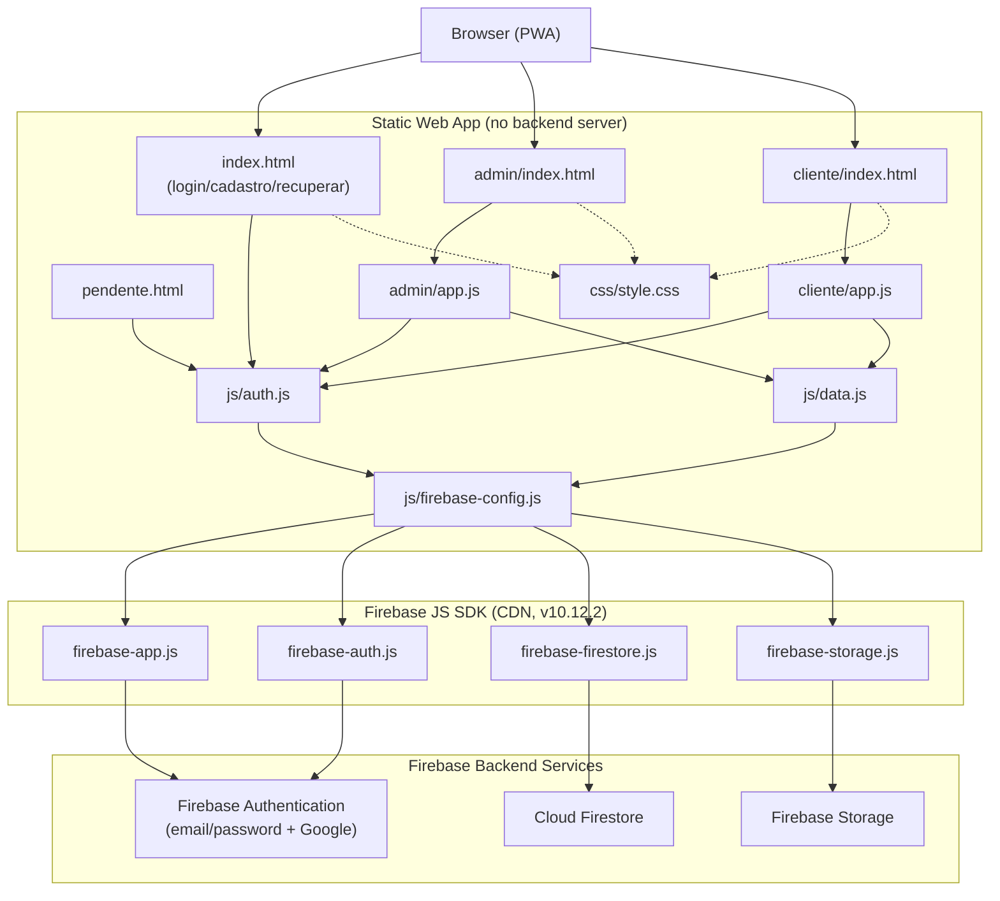
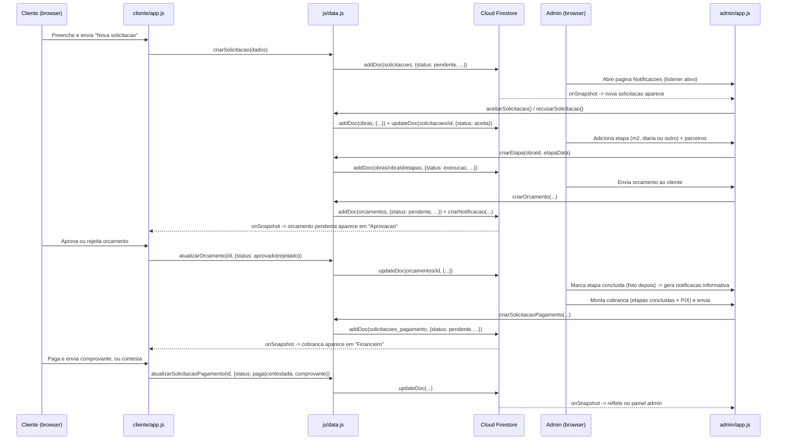

# System Architecture

## System Overview

EcoSistema ("Gestão de Obras") is a client-only static web application (no custom backend server). It is a Progressive Web App (PWA, per `manifest.json`) built with vanilla HTML/CSS/JavaScript (ES modules), meant to be hosted on any static host (the project's setup guide recommends Netlify) and installed to a phone's home screen. All persistence, authentication, and file storage are delegated to Google Firebase (Firebase Authentication, Cloud Firestore, Firebase Storage), accessed directly from the browser via the Firebase JS SDK loaded from a CDN (no npm install, no bundler, no build step). Authorization is enforced entirely through Firestore/Storage security rules (`firestore.rules`, `storage.rules`) rather than a server-side API — there is no Cloud Functions backstop for any privileged operation.

The app is split into three independently-loaded HTML entry points that share a common CSS file and a common data/auth layer:
- `index.html` — login, client self-registration (email/password + Google), password recovery, and role-based redirect.
- `admin/index.html` + `admin/app.js` — the contractor's full back office.
- `cliente/index.html` + `cliente/app.js` — the customer-facing companion app.
- `pendente.html` — holding screen for clients whose account is not yet approved.

## Architecture Diagram



### Text Alternative
```
Browser loads one of: index.html, admin/index.html, cliente/index.html
  index.html          -> js/auth.js -> js/firebase-config.js -> Firebase SDK -> Firebase Auth (email/pwd + Google)
  admin/index.html    -> admin/app.js -> js/auth.js + js/data.js -> firebase-config.js -> Firebase SDK -> Auth/Firestore/Storage
  cliente/index.html  -> cliente/app.js -> js/auth.js + js/data.js -> firebase-config.js -> Firebase SDK -> Auth/Firestore/Storage
All HTML entry points share css/style.css.
Authorization is enforced by firestore.rules and storage.rules server-side (no custom API layer, no Cloud Functions).
```

## Component Descriptions

### Login shell — `index.html`, `pendente.html`
- **Purpose**: Entry point for authentication and client self-registration; holding screen for clients pending approval.
- **Responsibilities**: Render login/cadastro/recuperar-senha tabs, call `js/auth.js` (including Google popup sign-in), redirect authenticated users based on `tipo`/`status` (`admin` → `admin/index.html`; `cliente` approved → `cliente/index.html`; `cliente` pending → `pendente.html`).
- **Dependencies**: `js/auth.js`, `css/style.css`, Tabler Icons webfont (CDN).
- **Type**: Application (UI entry point).

### Admin Panel — `admin/index.html` + `admin/app.js`
- **Purpose**: Back-office tool for the contractor.
- **Responsibilities**: Manage obras, etapas, encargos, parceiros and their payouts, preços, repasses, diárias, clientes (approval), admins, solicitações (incoming requests), orçamentos, and solicitações de pagamento (cobranças). ~1814 lines, single module, DOM built via string templates, all handlers exposed on `window`.
- **Dependencies**: `js/auth.js`, `js/data.js`, `css/style.css`, Tabler Icons webfont (CDN).
- **Type**: Application.

### Cliente Panel — `cliente/index.html` + `cliente/app.js`
- **Purpose**: Customer-facing companion app scoped to the logged-in client's own data.
- **Responsibilities**: View own obras/etapas/photos, submit solicitações, decide on orçamentos, register/respond to payments and cobranças, view read-only preços, and rate completed obras. ~815 lines, same structural pattern as the admin app.
- **Dependencies**: `js/auth.js`, `js/data.js`, `css/style.css`, Tabler Icons webfont (CDN).
- **Type**: Application.

### Shared Data/Auth Layer — `js/`
- `js/firebase-config.js` — initializes the Firebase app with a hard-coded config object and re-exports the SDK functions used elsewhere (single choke point for SDK imports).
- `js/auth.js` — `cadastrarCliente`, `cadastrarAdmin`, `login`, `loginComGoogle`, `logout`, `recuperarSenha`, `buscarPerfilUsuario`, `observarAuth` (auth-state + profile-fetch composite), `mensagemErroFirebase` (Firebase error code → Portuguese message map).
- `js/data.js` — all Firestore CRUD and real-time listener functions (obras, etapas, encargos, preços, repasses, parceiros, pagamentos, diárias, clientes, admins, solicitações, orçamentos, notificações, solicitações de pagamento, pagamentos de cliente) plus Storage upload helpers (`uploadFoto`, `fileParaBase64`), date helpers (`hoje`, `diasDiff`), and a stubbed WhatsApp notifier (`notificarWhatsApp`, currently `console.log`-only).
- **Type**: Shared/Client library (no server component).

### Styling — `css/style.css`
- **Purpose**: Single shared stylesheet (light/dark via `prefers-color-scheme`, CSS custom properties) used by all HTML surfaces, supplemented by small page-specific `<style>` blocks embedded directly in each HTML entry point.
- **Type**: Shared.

## Data Flow



## Integration Points

- **External APIs**: None beyond Firebase (Auth/Firestore/Storage) and the Tabler Icons webfont CDN stylesheet. `notificarWhatsApp()` in `js/data.js` is a stub containing commented-out sample code for a future Z-API WhatsApp integration — it currently only logs to the console and calls no external endpoint.
- **Databases**: Cloud Firestore — collections `usuarios`, `obras` (+ subcollections `etapas`, `encargos`), `precos`, `repasses`, `diarias`, `parceiros` (+ subcollection `pagamentos`), `solicitacoes`, `solicitacoes_pagamento`, `pagamentos_cliente`, `notificacoes`, `orcamentos`.
- **Third-party Services**: Firebase Authentication (email/password + Google OAuth popup), Firebase Storage (job/receipt/proof photos, uploaded as base64 data URLs), Netlify (deployment target per `LEIA-ME.md`, not part of the runtime architecture).

## Infrastructure Components

- **CDK Stacks**: None — this is a plain static site with no IaC.
- **Deployment Model**: Static file hosting (drag-and-drop deploy to Netlify per `LEIA-ME.md`); Firebase project (`gestaoecosytem`) configured manually via the Firebase console (Auth providers, Firestore rules, Storage rules) as documented in `LEIA-ME.md`.
- **Networking**: None self-managed; all backend network paths go through Firebase's managed endpoints and Firebase Security Rules (`firestore.rules`, `storage.rules`) rather than VPC/security groups.
