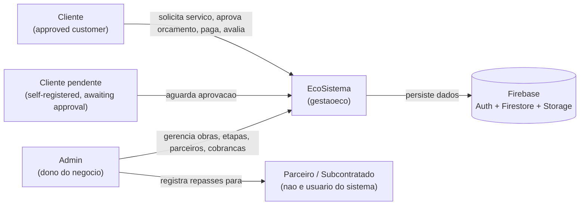

# Business Overview

## Business Context Diagram



### Text Alternative
```
Cliente (aprovado) --> App --> Firebase (Auth/Firestore/Storage)
Cliente (pendente) --> App (tela de espera "pendente.html")
Admin --> App --> Firebase
Admin --registra repasses para--> Parceiro (pedreiro/subcontratado, nao loga no sistema)
```

## Business Description

- **Business Description**: EcoSistema ("Gestão de Obras") is a Firebase-backed progressive web app for a small residential-construction contractor (empreiteiro) to manage jobs ("obras") end to end: intake of client service requests, staged execution with subcontractor ("parceiro") assignment and payout tracking, client-facing quotes ("orçamentos") requiring approval, billing/collections via two independent payment tracks, and post-completion client ratings. It has two panels — an **admin** panel (full operational control) and a **cliente** panel (self-service for the contractor's customers) — sharing a common Firebase backend and a login/registration shell.

- **Business Transactions**:
  1. **Cadastro e aprovação de cliente** — a prospective client self-registers (email/password or Google sign-in); the account starts `status: 'pendente'`; an admin approves or rejects it before the client gains panel access.
  2. **Solicitação de serviço** — an approved client submits a new service request (photos, description, location); admin accepts (converting it into an obra, optionally linked to the client) or rejects it.
  3. **Execução de obra** — admin creates/manages an obra's stages ("etapas": priced-by-m² work, day-labor "diárias", or manual "outros"), assigns parceiros with split payouts, uploads before/after photos, and marks stages/obra complete.
  4. **Orçamento (budget/quote) e aprovação** — admin sends a client a quote; the obra is blocked from further stage/diária additions until the client approves or rejects it. As of the 2026-07-04 change (see `LEIA-ME.md`), orçamento is the *only* entity that requires an explicit client decision — everything else is informational.
  5. **Cobrança / pagamento** — two independent payment tracks: (a) admin-initiated billing ("solicitação de pagamento") bundling completed unpaid stages with PIX details, which the client accepts+pays (uploading proof) or contests; (b) client-initiated self-reported payments ("pagamento_cliente") that admin confirms or contests.
  6. **Repasse a parceiros** — admin tracks and records amounts paid out to subcontractors per completed stage/diária, with proof-of-payment uploads.
  7. **Notificações** — admin actions (obra created/completed, etapa started/completed, diária registered, orçamento sent) generate an informational feed to the client.
  8. **Avaliação** — after an obra is marked completed, the client may rate it (1–5 stars + comment).
  9. **Gestão de administradores** — an existing admin can create additional admin accounts or promote an approved client to admin.

- **Business Dictionary**:

| Term | Meaning |
|---|---|
| obra | Construction job/project |
| etapa | Work stage/phase within an obra (m² service, "diária" day-labor, or "outros" manual item) |
| diária | Day-labor entry (paid per day); also a reference rate table by labor role |
| encargo | Miscellaneous cost/charge (materials, rentals) tied to an obra |
| parceiro | Partner/subcontractor (e.g. bricklayer) performing the work — not a system user |
| repasse | Payout/passthrough amount owed to a parceiro — internal cost, hidden from the client |
| preço / tabela de preços | Client-facing price list (R$ per m²) |
| orçamento | Budget/quote requiring client approval; blocks the obra while pending/rejected |
| solicitação | Client's request for a new service/job |
| solicitação de pagamento / cobrança | Admin's billing request to a client, bundling completed stages with PIX payment details |
| pagamento_cliente | Payment the client self-reports as made |
| aprovado / pendente / rejeitado | Approved / pending / rejected — status enum reused across several entities |
| a_pagar / pago / parcial | To-pay / paid / partially-paid — payment status enum |
| avaliação | Client's post-completion rating (1–5 stars) and comment |
| mostrarPedreiro | Admin toggle controlling whether the assigned worker's name is revealed to the client |

## Component Level Business Descriptions

### Root login shell (`index.html`, `pendente.html`)
- **Purpose**: Single entry point for authentication (login, self-registration, password reset) and role-based routing.
- **Responsibilities**: Authenticate the user, read their `usuarios` profile, and route admins to `admin/`, approved clients to `cliente/`, and pending clients to a holding screen (`pendente.html`) until approved.

### Admin panel (`admin/`)
- **Purpose**: Full operational control of the contracting business.
- **Responsibilities**: Manage obras/etapas/encargos/diárias/parceiros/preços/repasses, review and act on client solicitações, issue and track cobranças, respond to client-reported payments, approve/reject client accounts, and promote clients to admin.

### Cliente panel (`cliente/`)
- **Purpose**: Self-service portal for the contractor's customers.
- **Responsibilities**: Submit service requests, review obra progress and price tables, approve/reject orçamentos, register or respond to cobranças/payments, and rate completed obras.

### Shared services (`js/auth.js`, `js/data.js`, `js/firebase-config.js`)
- **Purpose**: Backend integration layer shared by both panels and the login shell.
- **Responsibilities**: Firebase SDK initialization, authentication flows, and all Firestore/Storage CRUD and real-time listener logic.
