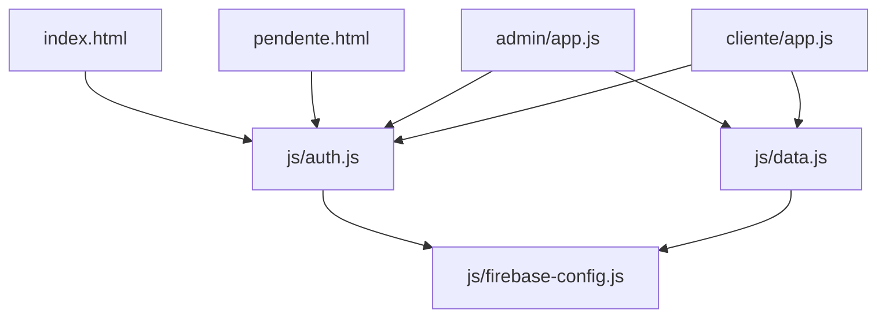

# Code Structure

## Build System
- **Type**: None. Plain static site — no `package.json`, no bundler, no transpiler, no test runner.
- **Configuration**: Firebase SDK is loaded per-file via `https://www.gstatic.com/firebasejs/10.12.2/...` ESM imports in `js/firebase-config.js` (and a second direct CDN import in `js/auth.js` for `GoogleAuthProvider`/`signInWithPopup`); icon font via a `<link>` to `cdn.jsdelivr.net` in each HTML file. Browser-native `<script type="module">` is the only "build" mechanism (native ES module resolution).

## Key Classes/Modules



### Text Alternative
```
index.html, pendente.html            -> js/auth.js
admin/app.js, cliente/app.js         -> js/auth.js, js/data.js
js/auth.js, js/data.js               -> js/firebase-config.js  (single Firebase SDK entry point)
```

There are no classes in this codebase — everything is plain functions and module-level mutable state (`let`/`const` globals per file), with UI event handlers attached by assigning to `window.<name>` and referenced from inline `onclick="..."` attributes in the HTML string templates.

### Existing Files Inventory

- `index.html` — Login/cadastro/recuperar-senha screen; inline `<script type="module">` wiring to `js/auth.js`; role-based redirect after auth.
- `pendente.html` — "Awaiting approval" holding screen for pending clients; inline script using `js/auth.js`.
- `manifest.json` — PWA manifest (name "Gestão de Obras", standalone display; no icons configured).
- `firestore.rules` — Firestore security rules (all authorization logic for data access).
- `storage.rules` — Firebase Storage security rules (currently only covers the `obras/**` path — see code-quality-assessment.md).
- `css/style.css` — Shared stylesheet for all surfaces; CSS variables + `prefers-color-scheme` dark mode; component classes (`.modal`, `.page`, `.bottom-nav`, `.badge-*`, `.toast`, etc.).
- `js/firebase-config.js` — Firebase app initialization (hard-coded config) and re-export of all Firebase SDK functions used by the rest of the app (single import chokepoint).
- `js/auth.js` — Authentication functions: `cadastrarCliente`, `cadastrarAdmin`, `login`, `loginComGoogle`, `logout`, `recuperarSenha`, `buscarPerfilUsuario`, `observarAuth`, `mensagemErroFirebase`.
- `js/data.js` — Firestore/Storage data-access layer: CRUD + real-time listeners for every business entity (see api-documentation.md), plus `uploadFoto`, `fileParaBase64`, `hoje`, `diasDiff`, `notificarWhatsApp` (stub).
- `admin/index.html` — Admin panel shell: topbar, `.page` sections (obras, execução, aprovação/notificações, parceiros, mais/settings), bottom nav, ~15 modal dialogs, lightbox; loads `admin/app.js` as a module.
- `admin/app.js` (1814 lines) — Admin panel logic: rendering, CRUD orchestration, pricing/repasse calculations, partner ledgers, request/orçamento/cobrança triage. See api-documentation.md and code-quality-assessment.md for detail.
- `cliente/index.html` — Client panel shell: `.page` sections (obras, aprovação/notificações, financeiro, histórico, preços), bottom nav, modals (nova solicitação, orçamento, avaliação, cobrança, pagamento), lightbox; loads `cliente/app.js` as a module.
- `cliente/app.js` (815 lines) — Client panel logic: own-obras view, solicitação CRUD, orçamento decision, cobrança/pagamento response, avaliação submission.
- `LEIA-ME.md` — Portuguese setup/operations guide (Firebase rules deployment, first-admin bootstrap, Netlify deploy, PWA install, business-flow description, changelog note for the 2026-07-04 orçamento/notificações change).

## Design Patterns

### Real-time listener + full re-render ("snapshot-driven UI")
- **Location**: Every `escutar*` function in `js/data.js` combined with the corresponding `render*` function in `admin/app.js`/`cliente/app.js`.
- **Purpose**: Keep the UI live-synced with Firestore without any client-side state library.
- **Implementation**: `onSnapshot` listener stores the full result array into a module-level variable, then calls a `render*()` function that rebuilds the relevant DOM subtree's `innerHTML` from scratch.

### Cascading/dependent listeners
- **Location**: `escutarTodasEtapas` (`js/data.js`) — subscribes one `onSnapshot` per obra's `etapas` subcollection and aggregates the results into a single callback.
- **Purpose**: Provide a flattened, cross-obra view of all etapas (used for dashboards/financial summaries) without a Firestore collection-group query.
- **Implementation**: Re-subscribes all per-obra listeners whenever the parent `obras` snapshot changes; both app files track the aggregate in `window._todasEtapas`.

### Global function registry as event-handling ("poor man's controller")
- **Location**: Throughout `admin/app.js` and `cliente/app.js`.
- **Purpose**: Let inline `onclick="fn(...)"` attributes in string-templated HTML call back into module logic (ES modules aren't globally scoped by default).
- **Implementation**: Functions assigned as `window.fnName = async (...) => {...}` instead of `addEventListener` + delegation.

### Manual subscription lifecycle management
- **Location**: `unsub*` variables (e.g. `unsubEtapasAtivas`, `unsubTodasEtapas`, `unsubEncargos`, `unsubPagamentos`) in both app files.
- **Purpose**: Avoid leaking Firestore listeners when navigating between detail views.
- **Implementation**: Each detail-open function calls the previous unsubscribe function (if any) before creating a new listener and storing the new unsubscribe function.

### String-based currency handling
- **Location**: `parseBRL`/`fmtBRL`/`fmtVal` in both app files.
- **Purpose**: Display and parse Brazilian-format currency (comma decimal separator) in plain `<input>` fields without a UI library.
- **Implementation**: Manual string replace (`','↔'.'`) instead of storing values as numbers or cents.

### Base64 photo upload pipeline
- **Location**: `fileParaBase64` + `uploadFoto` (`js/data.js`), used by every photo-upload flow in both app files.
- **Purpose**: Upload user-selected photos to Firebase Storage without a `multipart/form-data` request.
- **Implementation**: `FileReader` converts the selected file to a base64 data URL for local preview; on submit, the same data URL string is uploaded via `uploadString(ref, dataUrl, 'data_url')`.

## Critical Dependencies

### Firebase JS SDK (modular v10.12.2)
- **Version**: 10.12.2, loaded via CDN ESM imports (`https://www.gstatic.com/firebasejs/10.12.2/firebase-app.js`, `firebase-auth.js`, `firebase-firestore.js`, `firebase-storage.js`).
- **Usage**: All authentication, database, and file storage in the app go through this SDK, wrapped in `js/firebase-config.js`.
- **Purpose**: Serverless backend-as-a-service; no custom server or API needed.

### Tabler Icons Webfont
- **Version**: 2.47.0, loaded via `cdn.jsdelivr.net` `<link>` in every HTML file.
- **Usage**: All icons (`<i class="ti ti-...">`).
- **Purpose**: Iconography without bundling an icon library.

### Firebase project `gestaoecosytem`
- **Version**: N/A (external managed service configuration, not a code dependency).
- **Usage**: Hard-coded `firebaseConfig` object in `js/firebase-config.js` (apiKey, authDomain, projectId, etc.) — this app is pinned to one specific Firebase project.
- **Purpose**: Backend for Auth/Firestore/Storage.
