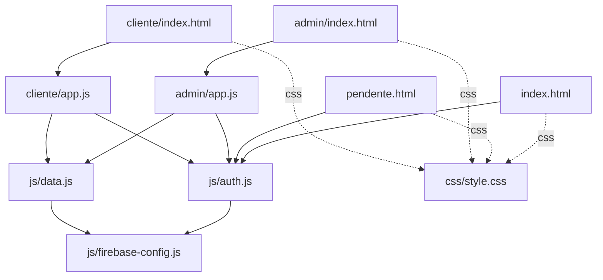

# Dependencies

## Internal Dependencies

### `admin/app.js` depends on `js/auth.js`
- **Type**: Runtime (ES module import)
- **Reason**: Uses `observarAuth` for the route guard/redirect, `logout` for sign-out, `cadastrarAdmin`/`mensagemErroFirebase` for creating new admin accounts and displaying friendly error text.

### `admin/app.js` depends on `js/data.js`
- **Type**: Runtime (ES module import)
- **Reason**: All Firestore CRUD/listener calls for obras, etapas, encargos, parceiros, preços, repasses, diárias, clientes, admins, solicitações, orçamentos, notificações, and solicitações de pagamento; also `uploadFoto`/`fileParaBase64` for photo handling.

### `cliente/app.js` depends on `js/auth.js`
- **Type**: Runtime (ES module import)
- **Reason**: Same route-guard/logout usage as admin, scoped to `tipo==='cliente'` and `status==='aprovado'`.

### `cliente/app.js` depends on `js/data.js`
- **Type**: Runtime (ES module import)
- **Reason**: Client-scoped listeners (`escutarObras`, `escutarSolicitacoes`, `escutarOrcamentos`, `escutarNotificacoes`, etc. called with `usuarioAtual.uid`), `criarSolicitacao`, orçamento decision updates, cobrança/pagamento registration, `uploadFoto`/`fileParaBase64`.

### `js/auth.js` depends on `js/firebase-config.js`
- **Type**: Runtime (ES module import)
- **Reason**: Uses the initialized `auth`/`db` instances and re-exported Firebase Auth/Firestore functions; also imports `GoogleAuthProvider`/`signInWithPopup` directly from the Firebase Auth CDN URL for Google sign-in.

### `js/data.js` depends on `js/firebase-config.js`
- **Type**: Runtime (ES module import)
- **Reason**: Uses the initialized `db`/`storage`/`auth` instances and re-exported Firestore/Storage functions.

### All HTML entry points depend on `css/style.css`
- **Type**: Runtime (stylesheet link)
- **Reason**: Single shared visual language (variables, components, dark mode) across login, admin, and cliente surfaces.

## External Dependencies

### Firebase JS SDK (modular)
- **Version**: 10.12.2
- **Purpose**: Authentication (email/password + Google OAuth), Firestore database access, Storage file upload/download — the entire backend integration surface of the app.
- **License**: Apache-2.0
- **Distribution**: Loaded directly from `https://www.gstatic.com/firebasejs/10.12.2/*.js` (no local copy, no package manager entry).

### @tabler/icons-webfont
- **Version**: 2.47.0
- **Purpose**: Icon font used throughout all UI surfaces (`<i class="ti ti-...">`).
- **License**: MIT
- **Distribution**: Loaded via `<link>` from `https://cdn.jsdelivr.net/npm/@tabler/icons-webfont@2.47.0/tabler-icons.min.css`.

### Firebase Backend Project (`gestaoecosytem`)
- **Version**: N/A (managed service, not a code library)
- **Purpose**: Hosts the actual Authentication users, Firestore data, and Storage files that the app reads/writes; config (apiKey, projectId, etc.) is hard-coded in `js/firebase-config.js`.
- **License**: N/A (Google Cloud/Firebase Terms of Service)
